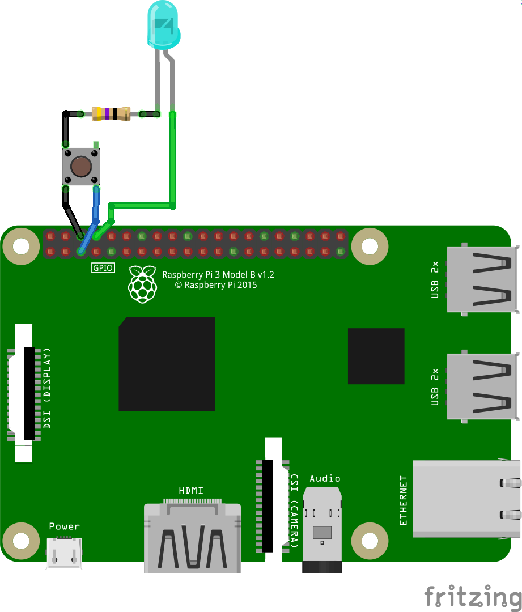
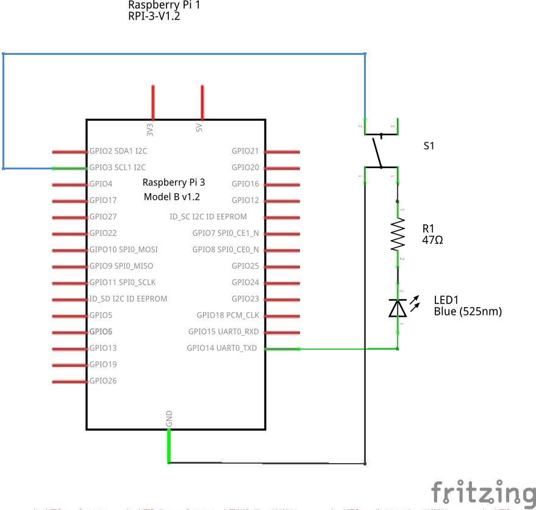

# IoM 2040 Shutdown Controller

This service shuts down the IoM 2040 device when a push button (GND) connected to GPIO 3 is pressed.

## Installation

Enter the following command in the terminal and the service will be automatically installed: 

```bash
wget https://raw.githubusercontent.com/Tknika/iom2040-shutdown-controller/master/install.sh -O - | sudo sh
```

## Configuration

Remember to configure ***/boot/config.txt*** file in your SD and ADD this line right after flashing the last Rasbian in your SD. 
 
1. Open your ***/boot/config.txt*** file while reading the SD in any operation system.  :computer: 
2. ADD the following line and SAVE.  :page_facing_up:

     ```enable_uart=1 ```
    
3. This will enable GPIO serial port which is disabled in newer versions of Raspbian Jessie (May 2016 and later).

## Electronics

Place and connect the following circuit on raspberry GPIOs.




## Modus operandi

This is the **install.sh** script modus operandi:

1. The script **listen-for-shutdown.py** waits to the GPIO3 to get GND for shutdown the raspberry pi at any time. :telephone_receiver:
2. The script **listen-for-shutdown.py** is placed at **/usr/local/bin/** by the **install.sh** script. :computer:
3. The script **listen-for-shutdown.service** makes the **listen-for-shutdown.py*** run every time the system starts. :high_brightness:
4. The script **listen-for-shutdown.service** is placed at **/etc/systemd/system/** by the **install.sh** script. :computer:
5. The script **install.sh** restarts and activate the needed daemons. :tractor: 
